# Xintra's & 13Cubed's KG Distribution Mini Lab Walkthrough

Writing up a walkthrough to a mini lab that touches upon memory analysis with a tool called MemProcFS.   The idea behind this lab is to perform memory forensics, but the cool catch here is that: one will be able to "mount" memory, as if it were a disk image into the investigating computer. 

Odd, because memory has no orienting File or Folder system, so how can it possibly work?

As this is a collaboration between Xintra and 13Cubed, more about this tool can be explored in the [latter's video here](https://www.youtube.com/watch?v=hjWVUrf7Obk&t=1s). 

The goal of the lab is to try and manipulate .mem files from a Workstation and a Server, and figure out details about it. 

### Section 1: Executing the MemProcFS and the relevant commands
Within the Xintra VM, navigate over to the MemProcFS folder, and ensure that the MemProcFS.exe is visible in it:  

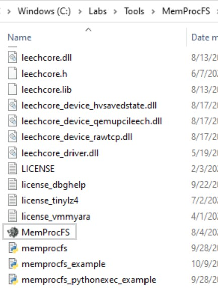

If that's set and ready, let's proceed.

At the location of the MemProcFS.exe, execute the following command on the .vmem file: `MemProcFS.exe -device C:\Labs\Evidence\KGDistribution\Workstation\WORKSTATION.vmem -forensic 1`

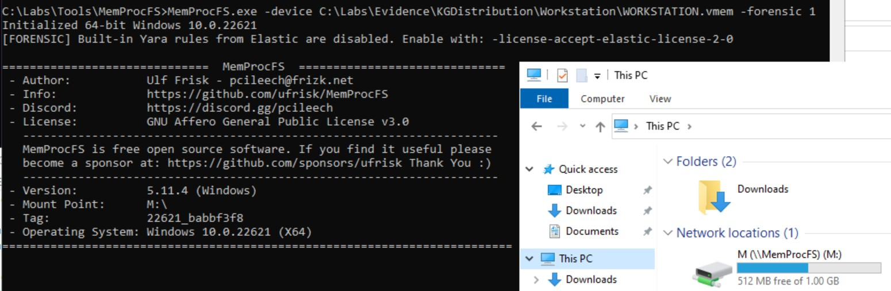

The `-forensic` flag tells MemProcFS to use some built-in "find evil" checks.  
The `-license-accept-elastic-license-2.0` flag that is mentioned here, helps makes use of some in-built YARA rules that can help decipher out known evil malware like Cobalt Strike, and ensures checks are done against these rules also. This will be handy in the 2nd part of the lab. 

The end result is the mount point appearing in the device as a default 'M:' in the investigating computer. Now that this is set, we can now minimise the command line window, and proceed with figuring out the lab questions. 

*It's only when Ctrl-C is pressed in the Command Line, that the MemProcFS process stops, and the mounting gets deactivated. Ensure it's not tampered with in the course of the lab*

### Section 2: Workstation

*Chances are, there are multiple ways to solve the questions of this mini lab, but choosing to demonstrate the most intuitive ones I've encountered when exploring this created file system from MemProcFS.*

Details of the Workstation:  

Its Hostname, can be found in `sys/computername` file:  

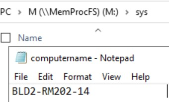

The primary user tied to this computer, in `sys/users`:  

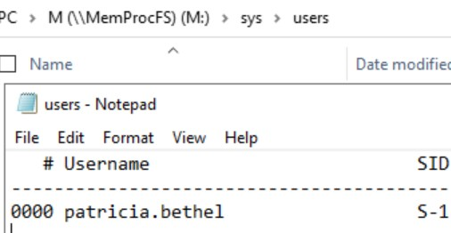

To find the network domain of this device, it's inside `registry\HKLM\SYSTEM\ControlSet001\Services\Tcpip\Parameters`:  

To find the IP Address of this device, it's in the same path as the previous value, but inside the Interfaces folder of it. `registry\HKLM\SYSTEM\ControlSet001\Services\Tcpip\Parameters\Interfaces`:  

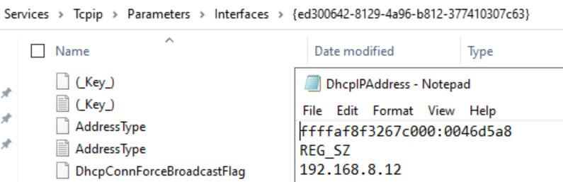

In this folder, there are various Interfaces, and not all of them are as feature rich, except for one. It's in one of the specific interfaces that an DhcpIPAddress value was found. 

*For this next question, there is an assumed scenario that the user would've opened this file as an offline .eml file*

To find the time at which this .eml file would've been opened, we can go back to the command we initially used. The '-forensic' flag that was introduced can help here, as this has helped make some relevant timeline files from where we can explore any file's MACB-timestamps and their paths. 

For this scenario, let's look into timeline_ntfs. When looking up the extension for emails (.eml), there's a telling sign that an .lnk file for the email was created (like a shortcut to just open the email file).

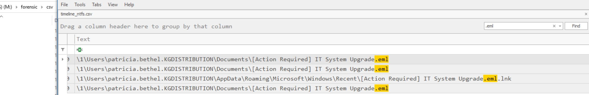

Scroll to the left side of the table, we can see that the earlier timestamp has the Action column as "CRE" - which means creation. In fact, the lines that show the same timestamp refer to the .eml file and the .lnk file. Therefore, it was first opened on 2024-08-18 16:31:58.

To find the remote administration tool downloaded into the workstation to gain a foothold, one potential path is `sys\net`, and the netstat-v file. 

Here, there's a sequence of connections that are very telling. 

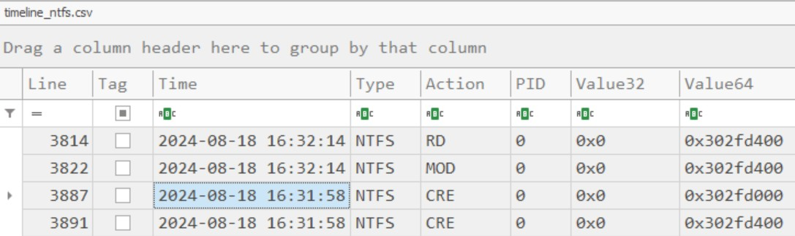

There's the first instance of dwagent.exe trying to listen for a connection establishment very shortly after the established time the email was opened. 

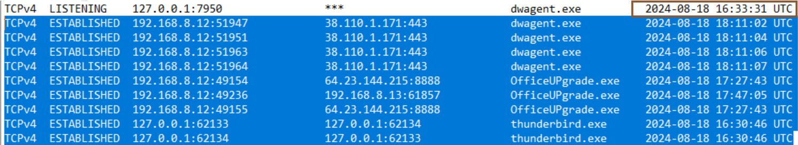

Following that, there's a sequence of thunderbird (a known software used to open email files), OfficeUPgrade.exe (some other software that's not yet known, but appears to match the theme of the email from the NTFS file), and finally, a successful established connection with dwagent.exe. This indicates that the dwagent.exe, especially with its 'listening' and 'established' connections behaviour, that this is the tool downloaded to gain a foothold into the system. 

*Bear in mind, this file speaks about connections between the workstation and external connections*. Prior to that, dwagent.exe would have to be executed before it was set-up to "listen" as seen in the previous file. 

Hence, to find the earliest execution time, the best file for that is in `sys/proc`. 

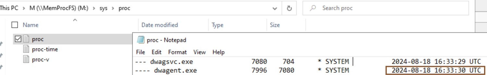

Around the time of compromise, the threat actors utilized a file transfer tool to download a malicious binary. To find the name of this tool, a useful place to go into was the Prefetch area of timeline_all.csv inside `forensic/csv`.

At that timeframe, there is a presence of Curl being used a tool being used around the same presence of the OfficeUPgrade related software. 

There are other artifacts to look into from here on, and one of them include a malicious binary that executed roughly after one minute of being downloaded. 

So let's recap: from the connections text file, we've seen presence of OfficeUPGrade.exe, followed by dwagent.exe. It's highly likely that OfficeUPGrade.exe is the malicious file, but let's look into the timelines to see if it is indeed that. 

After having the same Prefetch filter, locating and selecting the prefetch for OfficeUPGrade.exe, and removing that filter (this still helps us maintain that line selected), we can see a creation event of the OfficeUPgrade.exe (when it first landed into the system).

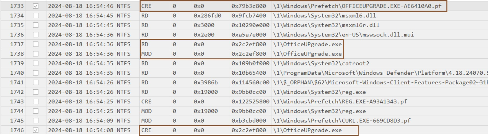

It's looking like this is the malicious binary as this timeframe shows it was executed within the minute it was downloaded. For this, a useful file to explore is timeline_registry.csv at `forensic/csv`. 

From the previous image, we know that initial activity around OfficeUPGrade.exe took place at 2024-08-18 16:54:08 - 16:54:46. Looking into that timeframe, there is one potential Registry Key modified. 

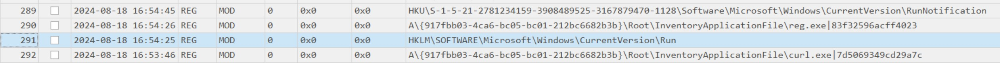

To find the attacker IP address the Process connects to, the promising file to look at is in `sys/net`. When looking at the Destination IP column for OfficeUPGrade.exe, its quite consistently at 64.23.144.215:8888. 

There are more things around the malicious binary OfficeUPGrade.exe that we can find. The lab hints at a malicious loader DLL that was injected into it. 

When looking into the `forensic/findevil` directory, there is visibility of a DLL module there. The rule to look out for is PE_INJECT. This type, PE_INJECT, locates malware by scanning for valid .DLLs and .EXEs with executable pages in their page tables located in a private (non-image) virtual address descriptor. More details on other flags are [here](https://github.com/ufrisk/MemProcFS/wiki/FS_FindEvil#:~:text=LOW-,PE_INJECT,-Injected%20Modules)

Alongside these so far, there's also presence of a malicious script. What is the script type? There's no clue: but there's a file we can revisit to try and figure out. 

When looking into timeline_ntfs.csv inside `forensic/csv`, when looking at roughly the hour from 2024-08-18 16:50:00 to potentially 18:00:00, and only looking at the 'CRE' values for the 'Action' column, there is one potential file present. 

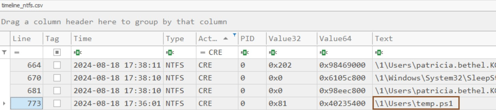

To confirm if this was the script that triggered the malicious OfficeUPGrade.exe, the path where it exists can be explored. As per this line in the csv, it mentions `\1\Users\temp.ps1`. Inside the `forensic/ntfs` folder, there is a '1' folder present. 

And while traversing the path, there is presence of another DLL mentioned here that was used by the TA through reflective DLL injection. 

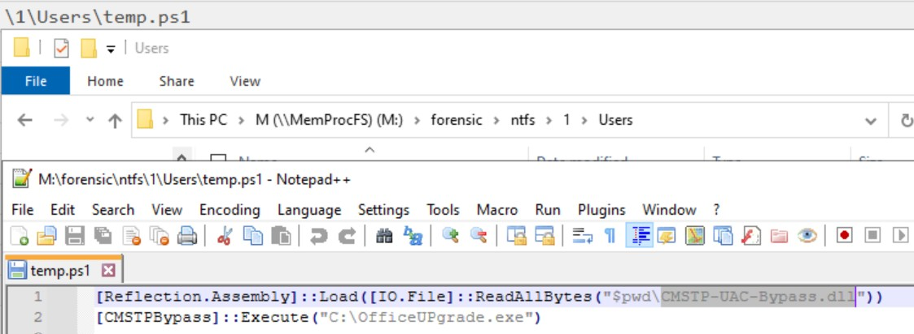

### Section 2: Server

Like before, the first thing to do is to execute the MemProcFS command on cmd inside the directory of the MemProcFS tool, and ensure it runs fully:
`MemProcFS.exe -device C:\Labs\Evidence\KGDistribution\Server\SERVER.vmem -forensic 1 -license-accept-elastic-license-2-0`
This time, the elastic-license flag gets added as we'd like to include YARA rules to find if anything evil took place in the machine.

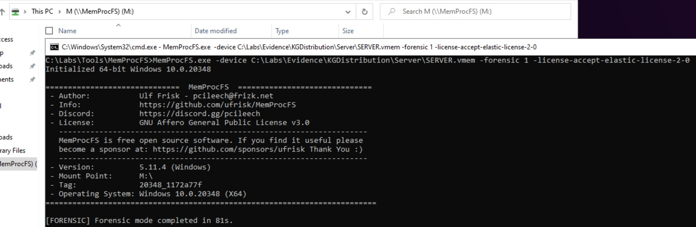

When the mount point is visible, we can proceed with finding out the details on the Server side. 

In case the Server had been compromised, and it had connected with the Threat Actor infrastructure, one way to see this is in `sys/net` directory, and see if it had connected with the TA's IP address found from the previous section ~ 64.23.144.215:8888. 

That is indeed visible, in the netstat-v file. 

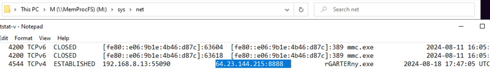

The malicious process that helped enable this connection is known as rGARTERny.exe, and has a pid of 4544. As for its path, it is true that some of it is visible in the last column of the netstat-v file, and it states the value: \Device\HarddiskVolume3\Windows\Temp ; however, the path interested here, involves the Drive letter in which Windows would be installed in the Server. 

It is possible to find that, in the pid directory from the Mount point. Here, details of every process is arranged by their PID. As the PID figured out is 4544, we can look into that folder. The path, in the style we're keen on, is in the win-cmdline.txt file: 

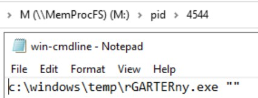

Another thing to find out, is the Parent Process ID that spawned this malicious process. In that same folder, there exists a file, ppid.txt, and that has a value of 648. Pivoting of this, when we look back into the netstat-v file, the parent process name tied to this is services.exe. 

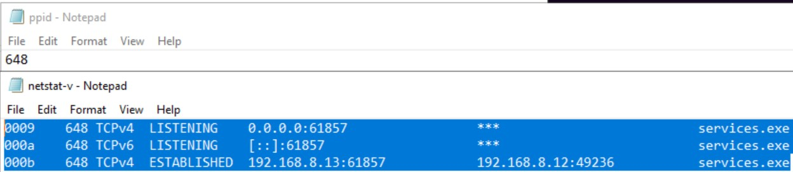

The lab hints that a persistence mechanism was created to launch the malicious process; as we know the parent process name is services.exe, the next thing to do was to look into the `sys/services` folder, and look into the services.txt file. There, the PID 4544 (that eventually got spawned), we can see that the Display name for the process, was kept as "officeupgradeservice". 

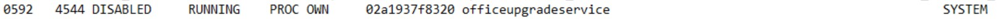

As this the 592nd line of the file, we can pivot off, and verify this in the `sys\services\by-id\592` folder. And here, it's consistent results with what has been observed so far. 

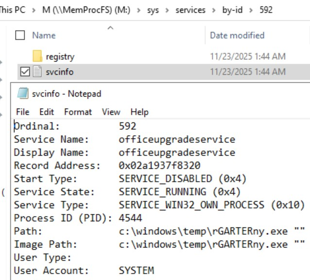

Another thing to check is if this malicious process (rGARTERny.exe, with PID 4544), had created more child processes. To do that, inside the directory `sys/proc`, the proc-v file shows that a child process had spawned from it, in its tree view: 

And towards the right, the powershell command that was tied to this child process. 

To find the path it might have used for persistence, the place to look into is the handles of this 4544 process. In the file, we can see a potential path for persistence: making use of the Administrator User and at Startup:

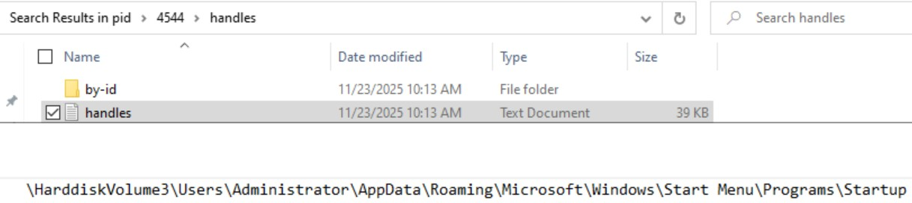

The lab also hints that this same directory was used for another binary. An easier way to see if other binaries exist, is in the `forensic/files/ROOT` directory from the mount point, and traverse through `Users\Administrator\AppData\Roaming\Microsoft\Windows\Start Menu\Programs\Starup` folder as discovered from the previous question. At that path, there is indication of the same OfficeUPGrade.exe binary, that was visible in the previous part of the lab. 

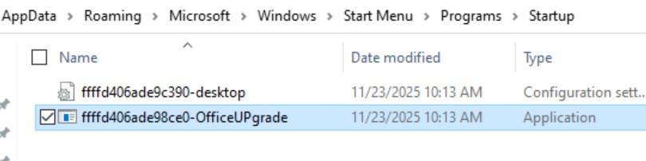

To check if other tools were used in this same malicious process, the best thing to do is to inspect the minidump associated with (ie: the memory dump of that 4544 process). This can be found in the `pid\4544\minidump` directory of that process. On it, a suggested tool to run is strings. 

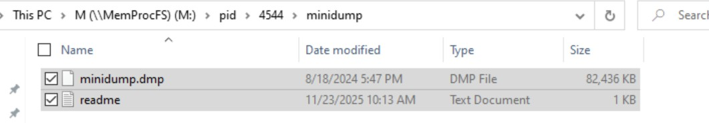

After moving the two files into the Desktop, and piping the results into a text file of the strings result, let's see what's available. After some attempts at the command, this one proved to be the most promising: the -a flag only ensure ASCII characters were found and piped into the text file, and the length of the strings had to be a little more substantial, at 5 characters long. 

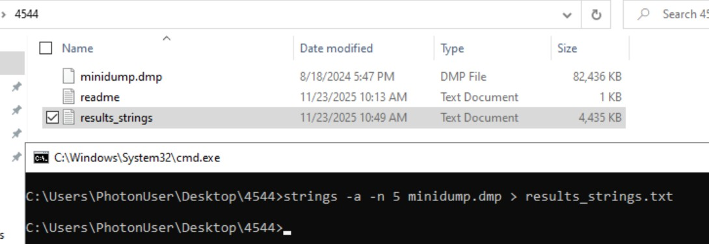

With the result open in Notepad++, the toolkit that was claimed to have been used was introduced around the 21.4k-th line or so. 

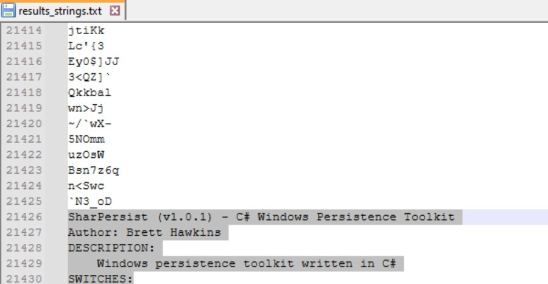

A C2 framework is also hinted at being used in this server. Makes sense as a connection to the Malicious IP address was discovered earlier. So something of interest must've been about in the system for the threat actor to target. 

Looking into the `forensic\findevil` directory, the findevil file shows a promising result:

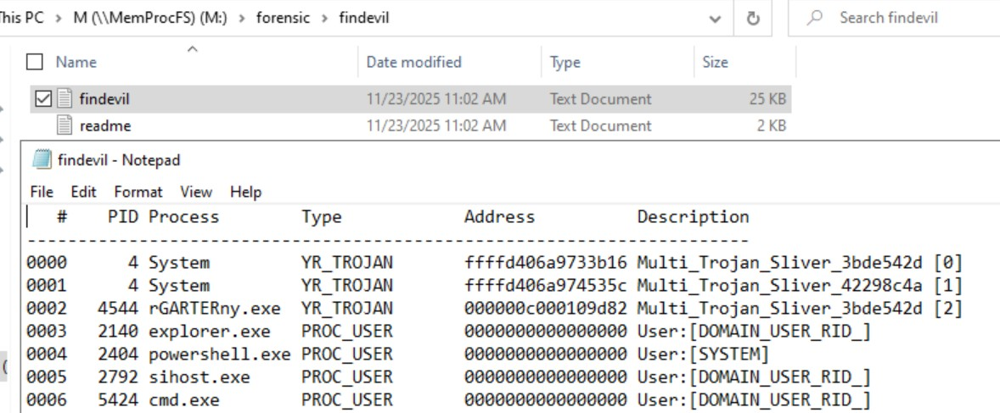

As per the YARA rule, a Sliver Trojan was found in the system. Now, with a high level of confidence, we can say that a Trojan was in the system to help establish a communication path to the threat actor's infrastructure. 

To try and see what it is that was created and staged to pull out of the server, the best path to look into is in the `forensic\csv` file, called timeline_ntfs.csv. When looking into it, around that timeframe on 18th August 2024, two files stood out at that time. When looking into the file system that was mimicked, `forensic\ntfs\2`, the same files were visible again: 

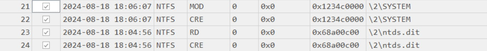

And that concludes this Mini Lab, and deep diving into MemProcFS. 
It's really a nice bridge as someone who hasn't delved into Memory Forensics prior, and see it presented as if it were a disk image, and the relevant folders around it. 
Mass shoutout to 13Cubed (find this brilliant resource's YouTube channel [here](https://www.youtube.com/13cubed)) for putting this together with Xintra. 

